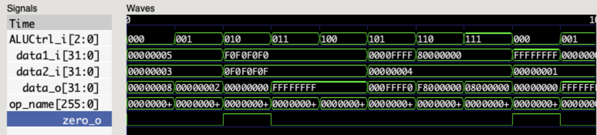
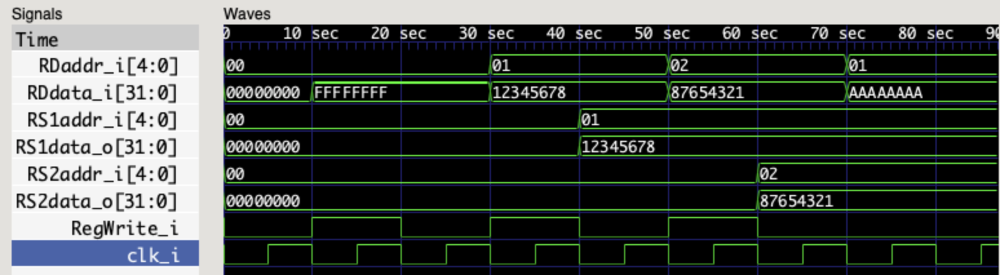

# Assignment 3 (Programming Part) Report

## 1.

Here are key points of my implementation:

### ALU Design
- data1_i (32-bit input): The first operand for the ALU operation
- data2_i (32-bit input): The second operand for the ALU operation
- ALUCtrl_i (3-bit input): The control signal specifying the ALU operation to perform
- data_o (32-bit output): The result of the ALU operation
- zero_o (1-bit output): A flag indicating if the output is zero
- I use combinational logic ```always @(*)``` for immediate output computation.

The ALU performs the following operations based on the ALUCtrl_i signal:
- 000: Addition
- 001: Subtraction
- 010: Bitwise AND
- 011: Bitwise OR
- 100: Bitwise XOR
- 101: Left Shift
- 110: Arithmetic Right Shift
- 111: Logical Right Shift

For addition and subtraction, if the result exceeds the range of a 32-bit unsigned integer, I implement wrap-around behvior.

I handle shift operations using only the lower 5 bits of data2_i.

## RISC-V Register File Design

- clk_i (1-bit input): The clock signal
- RS1addr_i (5-bit input): The address of the first source register
- RS2addr_i (5-bit input): The address of the second source register
- RDaddr_i (5-bit input): The address of the destination register
- RDdata_i (32-bit input): The data to be written to the destination register
- RegWrite_i (1-bit input): The write enable signal
- RS1data_o (32-bit output): The data from the first source register
- RS2data_o (32-bit output): The data from the second source register

The register file consists of 32 32-bit registers, with register 0 hardwired to zero.

When the RegWrite_i signal is high, the data in RDdata_i is written to the register specified by RDaddr_i on the rising edge of the clock.

The RS1data_o and RS2data_o outputs provide the data from the registers specified by RS1addr_i and RS2addr_i, respectively.

## 2.

### Commands used to run tests

```
# Compile ALU and its testbench
iverilog -o ALU ALU_tb.v ALU.v

# Run ALU testbench
vvp ALU

# Compile Registers and its testbench
iverilog -o Registers Registers_tb.v Registers.v

# Run Registers testbench
vvp Registers

# Open waveform in GTKWave
gtkwave ALU.vcd
gtkwave Registers.vcd
```

### Descriptions of my testbenches

**ALU_tb.v**

The ```ALU_tb``` testbench is used to verify an ALU module’s functionality by testing various arithmetic, logical, and shift operations. The testbench applies a set of predefined inputs and compares the ALU’s output against expected results. Each operation is given a name (e.g., "ADD", "SUB") based on the control signal (ALUCtrl_i), which helps identify the type of operation being tested. 
For each case:
- If the result is incorrect, an error message is displayed. 
- Otherwise, a success message is shown for each operation.

**Registers_tb.v**

The ```Registers_tb``` testbench verifies the behavior of a Register file module, particularly focusing on read and write operations, register zero behavior, simultaneous reads, and write enable functionality.
Each test sets up the necessary inputs (addresses, data, and RegWrite_i control), waits for a clock cycle, and verifies if the output matches the expected result. 
For each case:
- If the expected result is correct, a success message is printed.
- If the result is incorrect, an error message is displayed.

### Tests result

**ALU testbench:**
The test result is
```
Test ADD passed: 00000005 + 00000003 = 00000008
Test SUB passed: 00000005 - 00000003 = 00000002
Test AND passed: f0f0f0f0 & 0f0f0f0f = 00000000
Test OR passed: f0f0f0f0 | 0f0f0f0f = ffffffff
Test XOR passed: f0f0f0f0 ^ 0f0f0f0f = ffffffff
Test SLL passed: 0000ffff << 04 = 000ffff0
Test SRA passed: 80000000 >>> 04 = f8000000
Test SRL passed: 80000000 >> 04 = 08000000
Test ADD overflow passed: ffffffff + 00000001 = 00000000
Test SUB underflow passed: 00000000 - 00000001 = ffffffff
Test zero flag passed
```

gtkwave:


**Registers testbench**
The test result is
```
Test 1 passed: Register 0 remains 0
Test 2 passed: Write/Read to register 1 successful
Test 3 passed: Simultaneous read successful
Test 4 passed: Write disabled when RegWrite_i = 0
Test 5.1 passed: Register 3 is 0 before write
Test 5.2 passed: Read during write successful
```

gtkwave:

